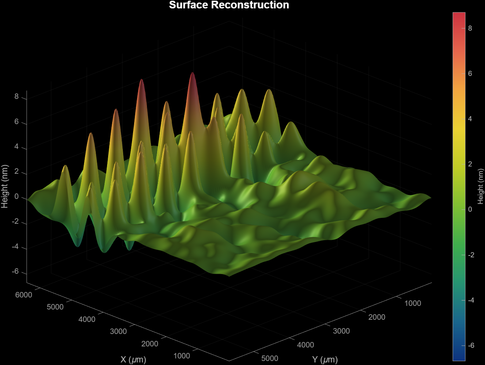

# TIE Phase Retrieval (MATLAB)

## Overview
This project implements Transport of Intensity Equation (TIE) phase retrieval to reconstruct phase information from intensity-only measurements.

The experiment is designed to characterize a low-cost spatial light modulator (SLM) built from an LCD. By analyzing how light intensity changes across slightly defocused images, the algorithm reconstructs a 3D phase map of the LCD surface.

The phase reconstruction reveals:

Surface texture and non-uniformities of the LCD Intensity variations caused by different Arduino-controlled patterns Optical behavior of a low-cost SLM system
---
## Methods 
1. Data Collection To perform TIE reconstruction, you must capture three intensity images using an optical setup.
Equipment: Light source (laser or LED) LCD (used as SLM) Lens Camera Optical rail (for precise positioning)

Steps: Align the optical system (light → LCD → lens → camera) Display a pattern on the LCD using Arduino (optional but recommended) Capture the following images: I₀ (In-Focus Image) Sharpest image Best focus position I⁺ (Forward Defocus) Move lens +5 mm forward from focus Capture image I⁻ (Backward Defocus) Move lens –5 mm backward from focus Capture image
⚠️ Important:

Keep lighting constant Ensure images are aligned Use small, controlled movements

MATLAB RECONSTRUCTION After collecting images, the phase is reconstructed using MATLAB. This reconstruction consists of two codes

run_TIE.m

Loads intensity images Applies preprocessing (noise reduction) Computes intensity derivative ∂I/∂z Calls the TIE solver

TIE_simple.m

Implements the Transport of Intensity Equation Uses intensity gradients to reconstruct phase Outputs a 2D phase map / 3D surface

steps

open matlab
Place your three images in the folder and update filenames in run_TIE.m: Example: I_plus = imread('zplus.JPG'); I0 = imread('I0.JPG'); I_minus = imread('zminus.JPG');
run the script in run_TIE

##  Files in This Repository

- `run_TIE.m` → Main script (run this file)
- `TIE_simple.m` → Core TIE equation solver
- `Tie Instructions` → Notes for how the process works

---

## ⚙️ How to Run the Code

1. Open MATLAB  
2. Navigate to this folder  
3. Make sure your images are in the folder  
4. Run:

```matlab
run_TIE
```

---

##  Data Collection (Experiment Steps)

To run this experiment, you must collect **3 images**:

1. **I0 (In Focus Image)**
   - This is the sharpest image (best focus)

2. **I+ (Forward Image)**
   - Move the lens slightly forward from focus  
   - Capture image  

3. **I- (Backward Image)**
   - Move the lens slightly backward from focus  
   - Capture image  

Example in MATLAB:

```matlab
I_plus  = imread('zplus copy.JPG');
I0      = imread('I04 copy.JPG');
I_minus = imread('zminus copy.JPG');
```

---

##  How the Code Works

### run_TIE.m
- Loads images  
- Sets parameters  
- Reduces noise  
- Computes intensity differences  
- Calls the TIE solver  

### TIE_simple.m
- Implements the Transport of Intensity Equation  
- Uses intensity and its derivative  
- Reconstructs the phase  

---

##  Results



---
A phase map of the LCD A 3D surface reconstruction Visualization of intensity variations

These results help analyze:

Surface irregularities Optical distortions Effects of different LCD patterns

NOTES Ensure images are well-aligned Use consistent illumination Keep defocus distance small (~5 mm) Avoid vibrations during capture Normalize intensity if needed

FUTURE WORK Test additional LCD patterns and voltages Improve noise filtering and stability Compare results with interferometric methods Automate image alignment and preprocessing

ACKNOWLEDGMENTS Dr. Hongbo Zhang for mentorship and guidance Middle Tennessee State University (MTSU), Department of Physics and Astronomy

I Have include my senior thesis, optical set up diagram, and resuts
##  Notes
- Make sure images are aligned  
- Use consistent lighting  
- Small movement between images is important  

---

##  Acknowledgements
Dr. Hongbo Zhang for guidance  
MTSU Department of Physics and Astronomy  
